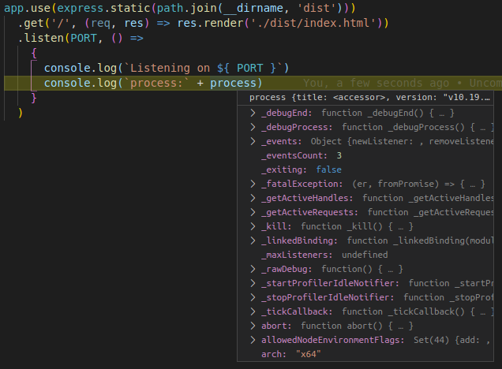

# Giải thích cụ thể từng dòng, từng file trong project
## 1. app.json
app.json là file chứa thông tin như biến môi trường, add-ons và những thông tin cần thiết khác để chạy app trên heroku. 
Xét ví dụ:
<pre><code>
{
  "name": "frontend for ngscang",
  "description": "frontend for ngscang",
  "repository": "https://github.com/sonphuong/nggulp",
  "logo": "https://cdn.rawgit.com/heroku/node-js-getting-started/master/public/node.svg",
  "keywords": ["node", "express", "heroku"],
  "image": "heroku/nodejs"
}
</code></pre>
repository: (string, optional) chỉ ra đường dẫn sourcecode của app
logo: (string, optional) đường dẫn chỉ ra logo của app (format SVG, PNG, or JPG).
keywords: (array, optional) là một mảng string mô tả về app.
image: (string, optional) khai báo Docker image cho Heroku-Docker để build app.
Tất cả đều là optional nên nếu không có file này app vẫn chạy bình thường
## 2. Procfile 
Chỉ ra cho Heroku những lệnh sẽ được khởi chạy khi hệ thống bật, proc là viết tắt của process,
được khai báo theo định dạng: <pre><code> process-type: command </code></pre> xem ví dụ
<pre><code> web: node index.js </code></pre>
process type ở đây là "web", lệnh sẽ được chạy là "node index.js" (ngoài process type là web ra còn có worker, urgentworker, clock...

## 3. index.json
<pre><code>
const express = require('express')
const path = require('path')
const PORT = process.env.PORT || 5000
const app = express()
app.use(express.static(path.join(__dirname, 'dist')))
  .get('/', (req, res) => res.render('./dist/index.html'))
  .listen(PORT, 
  () => {
    console.log(`Listening on ${ PORT }`)
    console.log(`process:` process)
  }
  )
`
</code></pre>
express: Express is a minimal and flexible Node.js web application framework that provides a robust set of features for web and mobile applications.
path: Path module provides a way of working with directories and file paths.
port: either get process.env.PORT or 5000 
### what is process.env.PORT? 
when Nodejs process boots up => creating an env object as property of the process global object.

now lets see ./dist/index.html
what to focus on? 
- ng-app 
- ng-view

ngView is a directive that complements the $route service by including the rendered template of the current route into the main layout (index.html) file. 
Every time the current route changes, the included view changes with it according to the configuration of the $route service.
Requires the ngRoute module to be installed.

## 4. gulpfile.js

### What os Gulp? 
gulp is an open-source JavaScript toolkit used as a streaming build system in front-end web development.
It is a task runner built on Node.js and npm, used for automation of time-consuming and repetitive tasks involved in web development like minification, concatenation, cache busting, unit testing, linting, optimization, etc...

eg: <pre><code>
//concat js dependencies
gulp.task('concatJsLibs',function(){
  gulp.src(scripts)
      .pipe(concat(jsLibsFile))
      .pipe(gulp.dest(pathJs))
      .pipe(browserSync.reload({
        stream: true
      }))
})
</code></pre>
#### Explain: 
- gulp.task('taskName', function(){ //here is what the task will do })
- gulp.src :Creates a stream for reading Vinyl objects from the file system.

Note: BOMs (byte order marks) have no purpose in UTF-8 and will be removed from UTF-8 files read by src(), unless disabled using the removeBOM option.
Vinyl is a metadata object that describes a file. The main properties of a Vinyl instance are path and contents - core aspects of a file on your file system (local or remote).